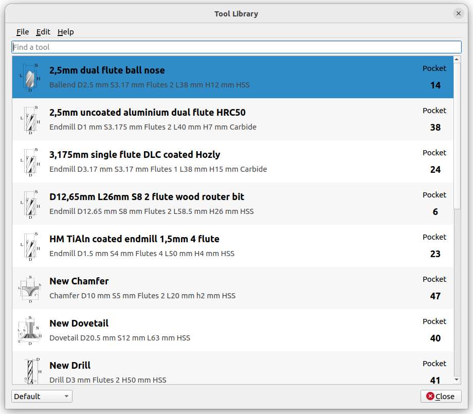
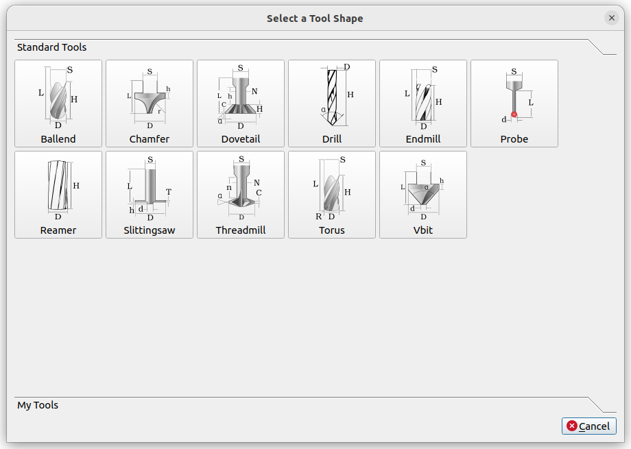
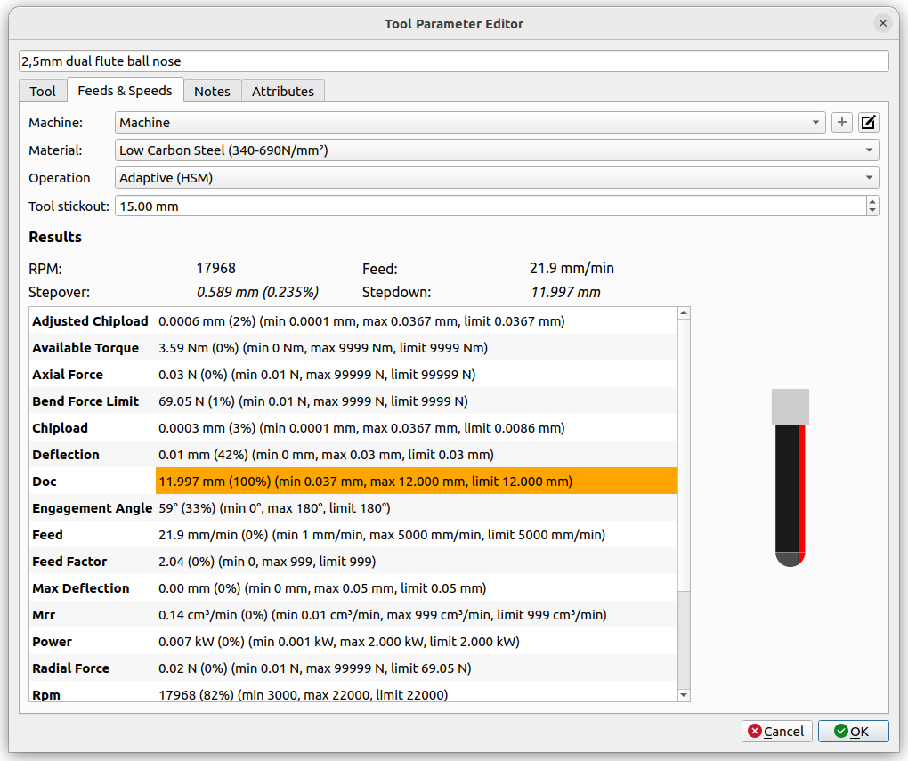

> [!WARNING]
> 2025-06-06: BTL IS DEPRECATED AND NO LONGER SUPPORTED AFTER FREECAD 1.01! The core features have been added directly into FreeCAD, so I recommend you remove the addon. While not all features are available in FC yet, I will add improvements directly into FreeCAD from now on.


# Better Tool Library (BTL)

Better Tool Library (BTL) is a [FreeCAD](https://www.freecad.org/) addon (plugin) that replaces the built-in tool library
for the CAM (previously known as the 'Path') workbench.
It also provides a standalone tool if you want to use your library outside of FreeCAD.

> [!WARNING]
> I advise you make a backup of your tool library. I guarantee for nothing, there may be bugs.

## Feature Comparison

| Feature                                            | Better Tool Library   | FreeCAD internal library  |
| :--                                                |        :--:           |          :--:             |
| Modern UI                                          |  |         |
| Provides a shape browser                           |  |         |
| Tool search                                        |  |         |
| [Powerful Feeds & Speeds calculator](docs/feeds-and-speeds.md) |  |         |
| [Tool sketch for supported shapes](docs/shape.md)  |  |         |
| [Use outside of FreeCAD](docs/standalone.md)       |  |         |
| Provides built-in common shapes                    |  |         |
| Store tool notes and additional info               |  |         |
| Auto-generates tool icons                          |  |         |
| Can be used with no document open                  |  |         |
| [CLI tool for import/export](docs/cli.md)          |  |         |
| Read BTL files                                     |  |      |
| Write BTL files                                    |  |  Deletes BTL extra data!¹  |
| [Import Fusion 360 tool library](docs/formats.md)  |  |         |
| [Import from Camotics](docs/formats.md)            |  |         |
| [Export to Camotics](docs/formats.md)              |  |      |
| [Export to LinuxCNC](docs/formats.md)              |  |      |

¹ The original FreeCAD CAM workbench tool editor deletes any unknown attributes from the tool when editing it. So if you use BTL to save BTL-only tool information like *Supplier* or *Description*, and then uninstall BTL and edit that tool with the FreeCAD tool editor again, the information will be erased.

## Screenshots







## Installation

### Prerequisites

- Better Tool Library (BTL) is compatible with any FreeCAD version greater than or equal to version 0.19.
- If you installed FreeCAD from source, you may also need to install the [Python requirements](requirements.txt). If you are using the Appimage this step is not necessary, as BTL has no requirements that are not already included in the Appimage.

### Installation via the FreeCAD addon manager

- Start FreeCAD
- Open the [Addon Manager](https://wiki.freecad.org/Std_AddonMgr) via *Tools -> Addon manager*
- Search for *Better Tool Library* and click on it
- Press *Install*
- You should see a prompt to restart FreeCAD, choose to restart

To run it, start FreeCAD and simply **open the CAM workbench**.  
There should be a new icon at the end of the toolbar:


### Installation in standalone mode

To use BTL via standalone (=outside of FreeCAD), you will have to install it using
setuptools.

```
pip install btl
```

Instructions for running BTL that way are [here](docs/standalone.md).

## Instructions

Some instructions can be found here:

- [Feeds & Speeds calculator](docs/feeds-and-speeds.md)
- [Import/export function](docs/formats.md)
- [Running BTL outside of FreeCAD](docs/standalone.md)
- [CLI tool](docs/cli.md)


## Links

- [License](LICENSE)
- [FreeCAD discussions](https://forum.freecad.org/viewtopic.php?t=79854)
